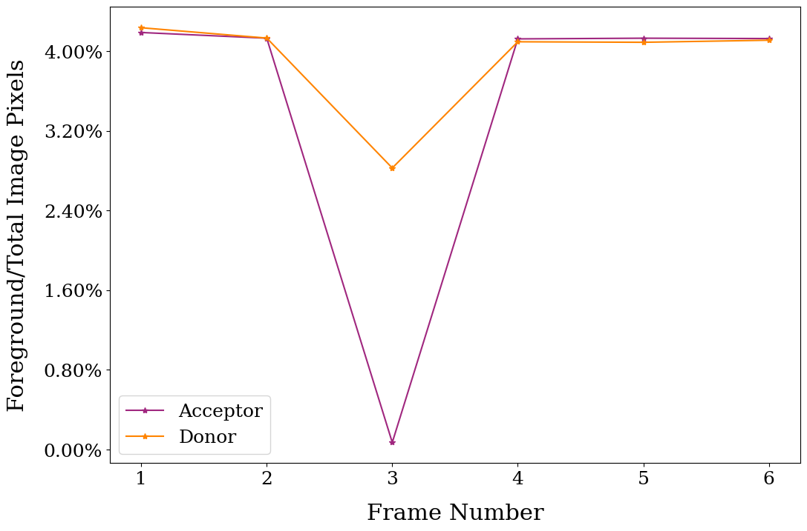
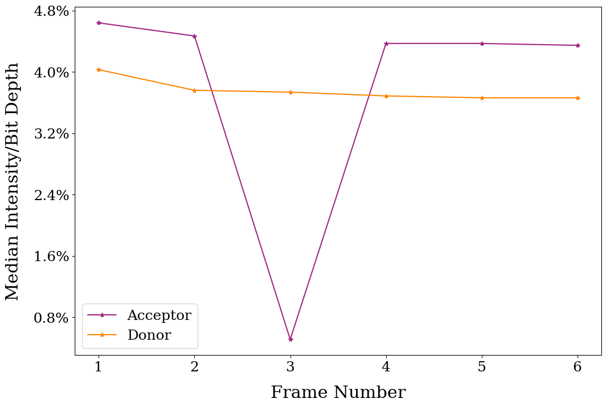

# Tutorial
The acceptor and donor image stacks should first be visualised in a package like ImageJ to extract general parameters like the range of frames of interest, region of interest, bit-depth, resolution, and the presence of shading/noise. These parameters are then set in the config file (.cfg) which also includes the path to the image stack files and other options for each module. A log file is generated with details on the input parameters after each module run.

The *Config_tutorial.cfg* file in */ibra* is used to demonstrate the functionality of this toolkit. Before processing, the donor and acceptor channel image stacks should be renamed using the following format
```txt
Acceptor *file_identifier*_acceptor.tiff
Donor    *file_idenfitier*_donor.tiff
```
First, the *input_path* (**absolute path**), *filename*, and *extension* parameters need to be set.
```txt
input_path = ./examples/stack 
filename = Test
extension = tif
```

The range of frames to be processed is then set with the parameter *frames*. Colon-separated values denote continuous frames, while comma-separated values denote manually selected individual frames. Furthermore, the *bit_depth* must be set to either 8, 12, or 16.
```txt
frames = 1:6
bit_depth = 12
```

## Modules
The user then has the option to run one of four modules. These modules are designed to run sequentially. The workflow is as follows:
* 0 -> Background subtraction (acceptor channel)
* 1 -> Background subtraction (donor channel)
* 2 -> Ratiometric processing
* 3 -> Bleach correction (optional)

## Background subtraction
The *background subtraction* modules (0 or 1) is run first.
```txt
option = 0
```

The background modules' parameters include *nwindow*, which is the number of tiles along the long axis of the image that the frame will be divided into, as well as the acceptor and donor channel *eps* values (the two channels are processed separately depending on whether *option* is set to 0 or 1) for the DBSCAN clustering algorithm. *nwindow* should be a factor of the image width (default: 40 for 1280X960).
Note, that the higher the *eps* value, the larger the number of pixels that are considered foreground. Very high *eps* values can thus label background pixels as foreground, reducing the effectiveness of the background subtraction algorithm (default: 0.01). 
```txt
nwindow = 40
eps = 0.01
```

The background subtraction module can then be run with multiple options including an output HDF5 file (-s) (necessary for further processing), a video animation of per-frame metrics (-a) and a TIFF output file (-t). Option (-e) indicates that all output options are switched on.
```bash
./ibra.py -c Config_tutorial.cfg -a -t -s -v
```
Once this module is run, the video animation can be used to optimize the *eps* values visually. As a general rule of thumb, the lower the *eps* value, the better the background subtraction. *eps* values that are too low to create clusters in a frame are recorded in the log file. 

## Ratiometric processing
Once both donor (*eps* of 0.01) and acceptor channels (*eps* of 0.012) have been processed, the *ratio* processing module should be run. The options include cropping (*crop*) the original image (by the top left and bottom right comma-separated coordinates) to the region of interest to speed up processing time. The default for *crop* is (0,0,0,0), which indicates that no cropping is performed. This module also includes boolean parameters for turning on image registration (*register*) and overlap correction (*union*). For best results, *register* and *union* should be set to 0 while the donor and acceptor channels are tested with suboptimal values of *eps*, and should only be set to 1 after the optimal values for *eps* are found.
```txt
crop = 0,0,0,0
register = 0
union = 0
```

The ratiometric processing module can then be run by setting *option* to 2. This generates two images which can be used along with the per-frame metrics animation generated by the background subtraction module to assess if the *eps* value must be redefined for specific frames of either channel.

### Ratio of the number of foreground pixels and the total number of pixels per frame


### Ratio of the median intensity of foreground pixels and image bit depth per frame


## Correcting individual frames
The median intensity per bit depth and ratio of foreground pixels to total pixels plots clearly show that frame 3 on the acceptor stack is a significant outlier with almost no foreground pixels. This can be corroborated with the background subtraction animation. If there is no experimental justification for this outlier, this frame can be corrected individually by re-running the background subtraction algorithm on frame 3 (acceptor channel only), with a lower *eps* value, followed by re-running the ratiometric processing module.
```txt
option = 0
frames = 3

nwindow = 40
eps = 0.009
```

## Bleach correction
Once all unexpected outliers have been corrected, the bleach correction module can be (optionally) run. The median intensity of the foreground in the donor and acceptor image stacks are used to estimate the range of frames (colon-separated) between which the bleaching effect can be fit. The type of fit: linear (regularized) or exponential regression must also be stated.
```txt
acceptor_bleach_range = 1:6
donor_bleach_range = 1:6
fit = linear
```
